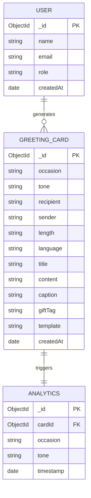
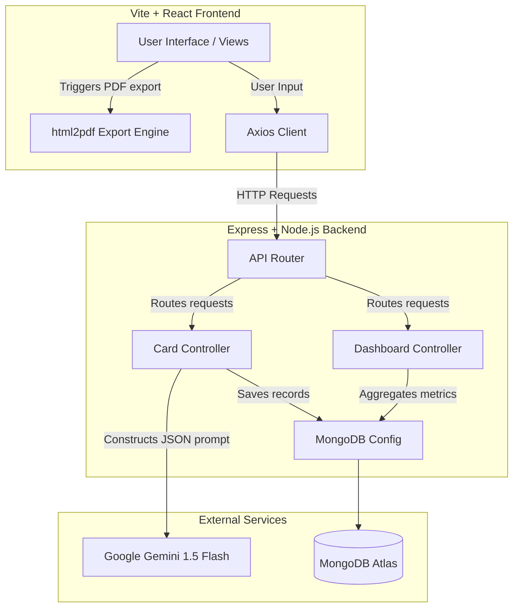

# Project Report: AI-Powered Greeting Card Generator (Paper Plane)

**Company:** Paper Plane  
**Academic Project Type:** Senior Internship Project Report  

---

## 1. Abstract
In the modern digital era, personalized gifting has evolved beyond physical items, placing greater value on emotional connectivity and expression. Writing the perfect card message is a common consumer bottleneck during checkout, often resulting in generic, uninspired copy. This project introduces **Paper Plane**, an AI-powered greeting card generation platform that leverages the Gemini 1.5 Flash Large Language Model (LLM) to instantly synthesize customized, high-quality, and emotionally resonant card copy. Users select occasions (e.g., Birthday, Anniversary, Festivals, Corporate Appreciation) and tone profiles (e.g., Funny, Romantic, Professional) to generate titles, body text, social media captions, and gift tags. The platform features responsive designer templates, print-ready PDF downloads, card histories, and an administrative analytics command center. 

---

## 2. Problem Statement
E-commerce consumers frequently struggle to express sentiments when sending gifts. The traditional greeting card checkout flow relies on static, pre-written templates that feel cold and impersonal. 
Key drawbacks of existing systems include:
1. **Inefficacy of Writing**: Users often experience writer's block when drafting personal greetings.
2. **Lack of Personalization**: Static options fail to reflect specific relationship dynamics or inside joke contexts.
3. **Rigid Structures**: Inability to adjust copy length, emotional intensity, or language dynamically.
4. **Poor Formatting**: Text boxes do not visual represent what the printed card looks like.

---

## 3. Objectives
The core goals of Paper Plane are:
- Develop a responsive web interface allowing users to input specific parameters and receive instant personalized greeting copy.
- Engineer prompt templates leveraging the Google Gemini API to structure outputs containing a Title, Card Message, Social Caption, and Gift Tag.
- Design themed templates (Classic, Modern, Romantic, Cheerful, Corporate) rendering card layouts on screen.
- Establish an Admin Dashboard summarizing usage metrics, popular categories, and generation trends.
- Enable offline resiliency allowing local template engines and in-memory databases to execute smoothly if APIs are disconnected.

---

## 4. Existing System Analysis
Current checkout attachments fall into two categories:
1. **Generic Free-Text Boxes**: Standard input textareas that put the entire creative writing load onto the user.
2. **Preset Picklists**: A dropdown of 5-10 pre-written phrases (e.g., "Happy Birthday!", "With Sympathy").

### Drawbacks
- **High Friction**: Results in empty card orders or flat cliches.
- **No Translation**: Hard to write messages in secondary languages (such as Hindi) without external tools.
- **Operational cost**: Staff must copy-paste or manually format the strings onto labels.

---

## 5. Proposed System
Paper Plane replaces writing hurdles with generative artificial intelligence. By collecting a minimal set of parameters (Recipient, Sender, Occasion, Tone, Length, Language), the system executes structured prompts through Gemini to return customized text. 

### Key Improvements
- **Emotion Engine**: Tone selector calibrates humor, romance, or formal registers.
- **Visual Print Preview**: Renders digital drafts instantly matching the final layout.
- **Single-Click Export**: Extracts raw text blocks or generates styled PDFs using `html2pdf.js`.
- **Admin Command Center**: Visualizes platform activity and category trends using Recharts.

---

## 6. Use Case Diagram
The user roles (Customer and Admin) interact with the system boundaries as follows:

```mermaid
leftToRightDirection
actor Customer
actor Admin

rectangle "Paper Plane System" {
  Customer --> (Select Occasion & Tone)
  Customer --> (Generate Card Copy)
  Customer --> (Switch Templates)
  Customer --> (Download Card PDF)
  Customer --> (Search Card History)
  
  Admin --> (Access Admin Panel)
  Admin --> (View System Analytics)
  Admin --> (Monitor Registered Users)
  Admin --> (Modify AI Rate Limits)
}
```

---

## 7. Entity Relationship (ER) Diagram
The database schema details relationships between Users, Greeting Cards, and Analytics logs:



---

## 8. System Architecture
The application runs on a classic decoupled MERN/VERN stack (Vite/React, Express, Node.js) talking to Gemini API and MongoDB:



---

## 9. Literature Survey
- **Generative Pre-trained Models (Gemini 1.5)**: Modern LLMs exhibit zero-shot reasoning capabilities. By prompting with specific variables (Sender/Recipient context), they write highly personalized, natural-sounding, and context-appropriate prose.
- **PDF Rendering in Browser**: Client-side canvas libraries (like html2canvas and jsPDF) allow developers to rasterize styled DOM structures and package them into documents without server load.
- **Aggregations in MongoDB**: The Mongoose framework's aggregation pipeline simplifies analytical grouping, making it highly efficient to extract daily trend charts and popular occasion ratios.

---

## 10. Testing Strategy
We utilize a multi-layered testing workflow to verify frontend responsiveness and backend logic:

| Testing Level | Scope | Method | Expected Output |
| :--- | :--- | :--- | :--- |
| **Unit Testing** | Backend Controllers | Local request isolation tests | Validate prompt sanitization and fallback data structures. |
| **Integration Testing** | API Routes | Postman / Axios calls | Endpoints return successful JSON schema payloads. |
| **System Testing** | End-to-end Generator | Browser execution | Forms submit parameters, render loader, and refresh card canvas. |
| **Acceptance Testing** | PDF & Clipboard | Manual checks | Verify downloaded files render template designs and text copies. |

---

## 11. Future Scope
- **Interactive Editor**: Allow inline rich text editing of cards after AI generations.
- **Image Generation Integration**: Incorporate Gemini/Imagen to design custom graphic backgrounds matching the card's occasion.
- **Multilingual Expansion**: Add localized support for regional languages (e.g., Spanish, French, Telugu, Tamil).
- **Physical Checkout APIs**: Build shopify integration hooks allowing merchants to print card outputs directly at packing tables.

---

## 12. Conclusion
Paper Plane represents a production-grade implementation of Generative AI inside a SaaS application. By replacing rigid text inputs with an intuitive tone-driven prompt compiler, the platform successfully solves consumer writing blocks while giving admins access to operational analytics.
